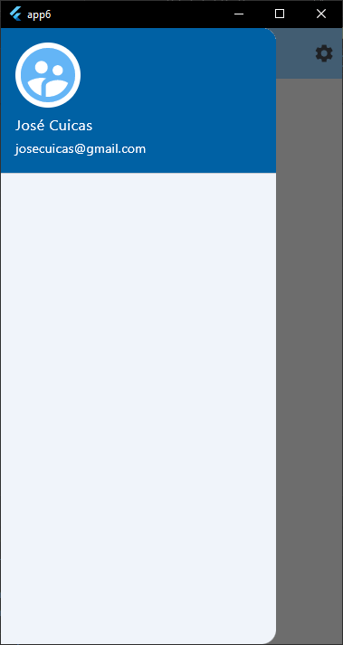

# app6

Un nuevo proyecto Flutter.

## Empezando

Este proyecto es un punto de partida para una aplicación Flutter.

Algunos recursos para ayudarte a comenzar si este es tu primer proyecto de Flutter:

- [Lab: Write your first Flutter app](https://docs.flutter.dev/get-started/codelab)
- [Cookbook: Useful Flutter samples](https://docs.flutter.dev/cookbook)

Para obtener ayuda para comenzar con el desarrollo de Flutter, consulte la
[online documentation](https://docs.flutter.dev/), que ofrece tutoriales,
muestras, orientación sobre desarrollo móvil y una referencia API completa.

# Vista previa de la app6

## Primera pantalla

## Código de la primera pantalla

## Segunda pantalla

## Código de la segunda pantalla

## Tercera pantalla

## Cuarta pantalla

## Código de la cuarta pantalla

## Quinta pantalla

## Código de la quinta pantalla

## Sexta pantalla

## Séptima pantalla

## Código de la séptima pantalla

## Octava pantalla

## Código de la octava pantalla

## Novena pantalla

## Código de la novena pantalla

## Décima pantalla

## Código de la décima pantalla

## Undécima pantalla

## Código de la undécima pantalla

## Duodécima pantalla

## Código de la duodécima pantalla

## Decimotercera pantalla

## Código de la decimotercera pantalla

## Decimocuarta pantalla

## Código de la decimocuarta pantalla

## Decimoquinta pantalla

## Código de la decimoquinta pantalla

## Decimosexta pantalla

## Código de la decimosexta pantalla

